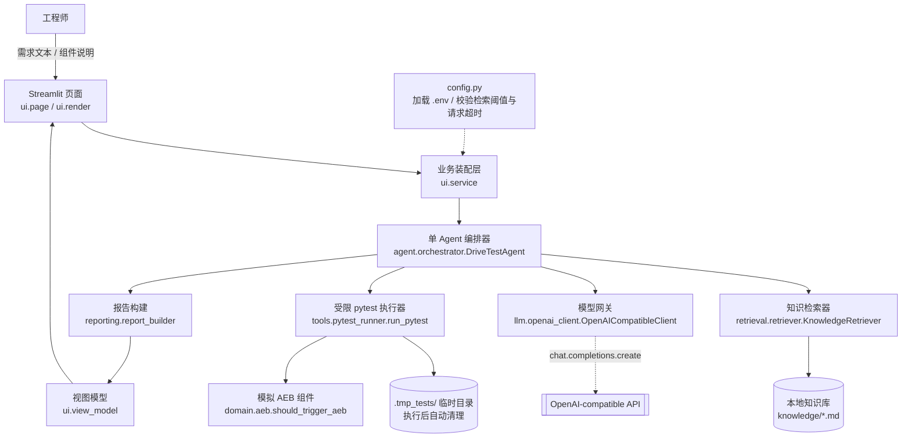

# DriveTest Agent

面向智驾软件集成场景的 **AI 测试生成原型**：给定一条需求/变更说明，系统检索本地测试规范、生成结构化 pytest 用例、在受限环境中执行、必要时修正一次，并输出可解释的结构化报告。

> 本项目是一个**面试/学习用原型**，不是量产系统。README 中每一句关于能力和安全性的描述都尽量对应到实际代码；请以「已知局限」章节为准，不做夸大。

## 目录

- [1. 岗位问题背景](#1-岗位问题背景)
- [2. 功能亮点](#2-功能亮点)
- [3. 为什么是单 Agent](#3-为什么是单-agent)
- [4. 为什么不用 LangChain：取舍分析](#4-为什么不用-langchain取舍分析)
- [5. 架构](#5-架构)
- [6. 数据流](#6-数据流)
- [7. 目录结构](#7-目录结构)
- [8. 从零启动（Windows PowerShell）](#8-从零启动windows-powershell)
- [9. 配置 OpenAI-compatible API](#9-配置-openai-compatible-api)
- [10. 运行测试](#10-运行测试)
- [11. 三个演示案例](#11-三个演示案例)
- [12. 指标与评测](#12-指标与评测)
- [13. 安全边界（务必阅读）](#13-安全边界务必阅读)
- [14. 已知局限](#14-已知局限)
- [15. 演进方向：LangGraph / MCP / 多 Agent / 容器化](#15-演进方向langgraph--mcp--多-agent--容器化)

## 1. 岗位问题背景

智驾软件集成场景中，组件接口或需求一旦变更，人工编写回归测试往往耗时且容易遗漏测试规范（尤其是阈值、等号方向、异常输入等边界条件）。DriveTest Agent 尝试构建一个**可运行、可验证、可讲解**的最小工程闭环，而不是堆叠框架：

```
需求/变更说明 → 检索测试规范 → 生成 pytest → 受限执行 → 分析结果 → 最多修正一次 → 输出报告
```

目标用户是负责智驾组件集成、回归测试和质量保障的开发/测试工程师。项目按「每天 1–2 小时、一周完成」的节奏设计（见 [7 天学习计划](docs/7-day-learning-plan.md)），并要求 Python 基础水平的开发者能读懂并讲解每一处核心代码。

完整设计规格见 [docs/superpowers/specs/2026-07-15-drivetest-agent-design.md](docs/superpowers/specs/2026-07-15-drivetest-agent-design.md)。

## 2. 功能亮点

- **Streamlit 单页演示**：填写需求、选择固定案例、查看规范引用、测试计划、pytest 代码、两次执行记录与指标。
- **本地 Markdown 知识库 + TF-IDF 检索**：`knowledge/` 下 4 份规范文档，字符级 n-gram TF-IDF + 余弦相似度检索，返回来源与相关度，低于阈值时明确标记「低置信度」。
- **单 Agent 有限状态编排**：检索 → 生成 → 执行 → 最多一次修正 → 报告，无隐藏框架循环、无无限重试。
- **Pydantic 结构化 Schema 贯穿全链路**：需求、检索结果、测试计划、执行结果、最终报告全部是校验过的 Pydantic 模型。
- **受限 pytest 执行器**：基于 AST 的导入/调用白名单与黑名单、执行超时、输出截断、临时目录隔离与自动清理（不是强安全沙箱，见第 13 节）。
- **模拟 AEB 组件**：确定性的 TTC/相对速度/传感器有效性判定逻辑，作为可测试的业务语境。
- **Fake LLM 驱动的集成测试**：不依赖真实 API Key即可验证完整链路的成功/失败/修正/低置信度路径。
- **CI 友好**：GitHub Actions 运行 `ruff check .` 与 `pytest -q`，不需要任何密钥、不访问任何付费 API。
- **`.env` 自动加载与显式配置校验**：项目根目录的 `.env` 会被自动加载（不覆盖已存在的系统环境变量），检索阈值和请求超时会被解析并校验，非法值会在**调用模型 API 之前**报出明确错误。

## 3. 为什么是单 Agent

当前任务是一个**步骤固定、上下文较小**的流水线（检索 → 生成 → 执行 → 最多修正一次 → 报告），并不需要动态规划、并行探索或多个独立角色的持续协作。在这种范围下，多 Agent 架构会带来：

- 更高的调用成本和延迟（角色之间的消息传递本身要消耗 token）；
- 更难调试的状态：出问题时要在多个 Agent 的对话历史里定位，而不是一个线性状态机；
- 面试/学习场景下更难在有限时间内讲清楚每一步在做什么。

因此这里选择一个显式、可预测的单 Agent 状态机（见 `drivetest_agent/agent/orchestrator.py` 中的 `DriveTestAgent`），状态、重试次数和停止条件都写在代码里，不依赖隐藏的框架循环。

**什么时候值得拆成多个 Agent？** 当任务本身出现了明显不同的职责边界，例如：需要一个「规划」角色先决定测试策略、一个「执行」角色专注生成和跑测试、一个「审查」角色对生成结果做独立复核；或者需要长期记忆、人工审批节点、多个任务并行处理。这些场景下，多 Agent（配合 LangGraph 这类显式图状态框架）能带来更清晰的职责隔离和可观测性——但也会引入更高的编排复杂度和运行成本，需要用真实的效果收益去换。

## 4. 为什么不用 LangChain：取舍分析

本项目没有把 LangChain / LangGraph / AutoGen 作为核心依赖，是有意的范围控制，而不是否定这些框架的价值：

| 维度 | 直接实现（本项目选择） | LangChain/LangGraph |
|---|---|---|
| 可讲解性 | 每一行状态转移、每一次重试都是普通 Python 代码，面试时可以逐行讲 | 需要额外讲解框架的抽象（Chain/Agent/Executor/回调），增加讲解面 |
| 依赖面 | 仅 `openai` SDK + `pydantic` + `scikit-learn`，版本变动风险低 | 引入额外的大型依赖树，版本迭代较快，学习/踩坑成本更高 |
| 调试难度 | 状态在 `AgentState` 里显式可见，报错位置直接对应到一个函数 | 框架内部循环和回调链有时会让报错栈更难定位 |
| 适用场景 | 步骤固定、无需持久化状态、无需人工审批节点 | 需要动态规划、分支工作流、可恢复的长时状态、丰富的工具生态时更有优势 |
| 一周可交付性 | 便于在 1 周、每天 1–2 小时内完成并测试 | 引入框架本身的学习曲线会挤占核心逻辑的实现时间 |

**取舍是场景相关的**：如果需求变成「需要人工审批中间结果」「需要多个可恢复的长任务并行跑」「需要复用大量现成工具集成」，LangGraph 的显式图/状态模型会是更合适的下一步（见第 15 节演进方向），而不是本项目当前范围应该解决的问题。

## 5. 架构



测试时，`llm.openai_client.OpenAICompatibleClient` 会被 `llm.fake_client.FakeLLMClient`（队列式返回固定 `LLMGeneration` 或异常）替换，因此集成测试完全不触达图中的 `API` 节点。

## 6. 数据流

1. 用户在 Streamlit 页面提交需求文本（可选组件说明），或点击「填充该案例」选用固定演示案例。
2. `ui.page._handle_run_click` 校验输入非空，并通过 `ui.service.missing_llm_config_message()` 检查 `OPENAI_API_KEY` 是否已配置（未配置则直接展示安全错误，不会构建 Agent）。
3. `ui.service.build_agent()` 加载 `.env`、解析并校验 `RETRIEVAL_MIN_RELEVANCE` 与 `OPENAI_REQUEST_TIMEOUT_SECONDS`，构建 `KnowledgeRetriever`、`OpenAICompatibleClient` 和 `DriveTestAgent`。
4. `DriveTestAgent.run()` 先调用检索器，若所有引用都是低置信度或无结果，直接返回 `insufficient_info` 报告，不调用模型。
5. 否则，构造生成 Prompt（`llm.prompts.build_generation_prompt`），调用模型得到结构化 `TestPlan`（Pydantic 校验；格式非法自动重试一次，仍失败则终止并返回 `error`）。
6. `tools.pytest_runner.run_pytest` 在 `.tmp_tests/` 下的隔离临时目录中执行生成的 pytest 代码，返回退出码、通过/失败数、耗时和截断后的错误摘要。
7. 若首次执行失败，Agent 携带截断后的错误摘要（添加截断标记并保留尾部内容，最多 1500 字符）重新请求一次修正，再执行一次；两次都失败则停止，不再重试。
8. `reporting.report_builder.build_report` 汇总规范引用、测试计划、两次执行记录、token/耗时统计和最终结论，生成 `AgentReport`。
9. `ui.view_model.build_report_view_model` 把报告转换为纯数据的展示模型（不含任何 Streamlit 依赖，可独立单测）。
10. `ui.render` 把展示模型画成页面；应用**不会**自动修改被测组件的源代码。

## 7. 目录结构

```
项目/
├── .github/workflows/ci.yml        # CI：ruff + pytest，不需要任何 API Key
├── app.py                          # streamlit run app.py 的入口
├── pyproject.toml                  # 依赖、pytest/ruff 配置
├── .env.example                    # 环境变量示例（不含真实密钥）
├── docs/
│   ├── superpowers/specs/2026-07-15-drivetest-agent-design.md  # 设计规格
│   ├── demo-script.md              # 5 分钟面试演示脚本
│   ├── 7-day-learning-plan.md      # 7 天学习计划
│   └── interview-qa.md             # 面试问答
├── examples/cases.json             # 3 个固定演示案例
├── knowledge/                      # 本地测试规范知识库（4 份 Markdown）
│   ├── aeb-input-constraints.md
│   ├── boundary-exception-testing.md
│   ├── integration-regression-checklist.md
│   └── pytest-naming-assertions.md
├── src/drivetest_agent/
│   ├── config.py                   # .env 加载、检索阈值与请求超时校验
│   ├── domain/                     # Pydantic 模型（models.py）+ 模拟 AEB 组件（aeb.py）
│   ├── retrieval/                  # Markdown 切分（chunking.py）+ TF-IDF 检索（retriever.py）
│   ├── llm/                        # LLM 协议、OpenAI 兼容客户端、Fake 客户端、Prompt 构建
│   ├── agent/                      # 单 Agent 有限状态编排器（orchestrator.py）
│   ├── tools/                      # 受限 pytest 执行器（pytest_runner.py）
│   ├── reporting/                  # 报告构建（report_builder.py）
│   └── ui/                         # Streamlit 页面、渲染、视图模型、业务装配
└── tests/                          # 与 src 结构对应的单元/集成测试
```

## 8. 从零启动（Windows PowerShell）

以下命令假设当前目录已经是本仓库根目录（例如 `D:\with_job\项目`）。

```powershell
# 1. 创建并激活虚拟环境
python -m venv .venv
# 如果执行策略阻止激活脚本，先运行（仅当前进程生效，不修改系统策略）：
#   Set-ExecutionPolicy -Scope Process -ExecutionPolicy Bypass
.\.venv\Scripts\Activate.ps1

# 2. 安装项目（核心依赖含 pytest；dev 附加依赖含 ruff）
python -m pip install --upgrade pip
python -m pip install -e ".[dev]"

# 3. 准备环境变量文件
Copy-Item .env.example .env
notepad .env   # 填入真实的 OPENAI_API_KEY（.env 已在 .gitignore 中，不会被提交）

# 4. 运行测试，确认环境正常
pytest -q

# 5. 启动 Streamlit 演示
streamlit run app.py
```

浏览器会自动打开 `http://localhost:8501`。未配置 `OPENAI_API_KEY` 时，界面会展示明确的配置错误提示，而不是卡住或抛出未处理异常。

## 9. 配置 OpenAI-compatible API

所有配置通过环境变量或 `.env` 文件提供（见 `.env.example`）：

| 变量 | 必填 | 默认值 | 说明 |
|---|---|---|---|
| `OPENAI_API_KEY` | 是 | 无 | 未设置时应用不会调用模型，会展示安全的配置提示 |
| `OPENAI_BASE_URL` | 否 | `https://api.openai.com/v1` | 任何兼容 OpenAI Chat Completions 协议的服务地址均可 |
| `OPENAI_MODEL` | 否 | `gpt-4o-mini` | 模型名称 |
| `OPENAI_REQUEST_TIMEOUT_SECONDS` | 否 | `60` | 单次模型请求超时（秒）；必须是有限正数 |
| `RETRIEVAL_MIN_RELEVANCE` | 否 | `0.15` | 检索最高相关度低于该阈值即标记「低置信度」；必须是 `[0, 1]` 之间的小数 |

行为说明：

- 应用启动时会自动从**项目根目录**的 `.env` 加载这些变量（`drivetest_agent.config.load_dotenv_if_present`，基于 `python-dotenv`），但**不会覆盖**已经在系统/终端环境中设置的同名变量——真实环境变量始终优先。
- `RETRIEVAL_MIN_RELEVANCE` 会被显式解析和校验（`drivetest_agent.config.parse_retrieval_min_relevance`）：不是数字，或不在 `[0, 1]` 闭区间内，都会在构建 Agent 时抛出 `ConfigError` 并在界面上展示明确的中文错误信息——这一步发生在任何模型客户端被创建之前，**不会触发任何 API 调用**。
- `OPENAI_REQUEST_TIMEOUT_SECONDS` 同样在客户端创建前校验（`drivetest_agent.config.parse_openai_request_timeout_seconds`）：零、负数、非数字、`NaN` 或无穷大都会产生包含变量名的明确 `ConfigError`，不会触发 API 调用。
- API Key 永远不会写入仓库；仓库里只有 `.env.example` 这份不含真实密钥的示例文件。

## 10. 运行测试

```powershell
pytest -q          # 运行全部单元与集成测试（不需要网络、不需要 API Key）
ruff check .        # 静态检查与风格检查
```

测试完全不依赖真实模型 API：LLM 相关测试使用 `llm.fake_client.FakeLLMClient`（队列式返回固定响应）或对 `openai` 客户端对象打桩；Streamlit 相关测试使用 `streamlit.testing.v1.AppTest`，并在测试中显式清空 `OPENAI_API_KEY`，只验证「未配置」安全路径，不会发出真实请求。

## 11. 三个演示案例

固定案例定义在 [`examples/cases.json`](examples/cases.json)，可直接在 Streamlit 页面的下拉框中选择并一键填充：

1. **信息完整的正常需求**（`normal_complete`）：「TTC 小于等于 1.5 秒、相对速度为正、传感器有效时触发制动」——期望走完整链路并生成通过的测试。
2. **容易遗漏边界的需求**（`boundary_equality`）：显式要求覆盖 TTC 等号（1.5 秒）以及阈值两侧（1.49 / 1.51）——用于演示系统能否按规范生成边界用例，以及首次失败后的修正路径。
3. **信息不足的需求**（`insufficient_info`）：一个与本地知识库（AEB 相关规范）完全不相关的车机天气小组件需求——用于演示检索低置信度时系统会诚实返回「信息不足」，而不是编造一份看似完整的测试。

演示脚本见 [docs/demo-script.md](docs/demo-script.md)，包含每个案例的点击步骤和预期界面表现，以及模型调用失败时的备用讲解方案。

## 12. 指标与评测

DriveTest Agent 的「评测」目前是**面向单次运行的可解释指标**，而不是一套独立的离线评测基准（离线评测集是明确列在第 15 节的后续演进项，当前版本不包含）：

- **单次运行指标**（`AgentReport`，由 `reporting.report_builder` 计算）：首次执行通过率（`pass_rate_first_run`）、修正后通过率（`pass_rate_after_correction`）、修正次数（0 或 1）、累计 token 用量、累计耗时、最终状态（`success` / `failed` / `insufficient_info` / `error`）。
- **代码正确性的评测**：以自动化测试套件本身作为主要证据——`pytest -q` 覆盖了检索器、Pydantic 模型、Prompt 构建、OpenAI 客户端解析与重试、受限执行器的黑白名单与超时、Agent 的全部状态转移路径（成功/修正后成功/两次失败/低置信度/模型错误/执行器异常）、报告构建、以及 Streamlit 页面在「无 API Key」路径下的行为。
- **验收案例**：第 11 节的三个固定案例即是本项目的人工验收标准，覆盖正常、边界、信息不足三类场景。

## 13. 安全边界（务必阅读）

**`tools.pytest_runner.run_pytest` 不是一个强安全沙箱**，它是一个「受限执行器」，只做到了以下几点：

- 基于 AST 的**导入白名单**（仅允许 `pytest`、`math`、`drivetest_agent`）与**黑名单**（禁止 `os`、`subprocess`、`pathlib`、`socket`、`sys`、`shutil`、`builtins` 等）。
- 基于 AST 的**危险调用黑名单**（`eval`、`exec`、`compile`、`open`、`__import__`、`getattr`、`vars`、`globals`、`locals`）与**危险属性/名称黑名单**（`__builtins__`、`__globals__`、`__class__`、`__subclasses__` 等常见逃逸手法）。
- 生成的代码写入项目内的 `.tmp_tests/` 隔离临时目录，用固定解释器以 `subprocess` 方式执行，设置了执行超时（默认 5 秒）和输出截断（默认 4000 字符），执行结束后清理临时目录。

**它做不到，也没有声称做到**：

- 没有容器、虚拟机或操作系统级别隔离；生成的代码仍然运行在宿主 Python 解释器进程里，能访问宿主机的文件系统权限范围内的一切资源（黑名单只挡住了「直接 import / 直接调用」这条路，不是形式化证明的沙箱）。
- 没有 CPU/内存/磁盘配额限制，没有网络隔离，没有 seccomp/系统调用过滤。
- AST 黑名单本质上是启发式防御，面对足够刻意的对抗性输入（例如利用尚未列入黑名单的间接反射路径）不能保证 100% 拦截。

**结论：本原型的受限执行器仅用于「可信来源」的生成代码演示（模型生成的测试代码在可控的知识库和 Prompt 约束下），绝不能用于执行不可信的公网用户提交的代码，也不能视为生产级隔离方案。** 生产化需要至少：容器化执行环境、资源配额、网络隔离、更严格的系统调用限制（如 gVisor/Firecracker 级别隔离），以及独立的安全评审。

## 14. 已知局限

- **检索是词法级 TF-IDF，不是语义检索**：基于字符 2–4 gram 的 TF-IDF + 余弦相似度，能处理中文（无需分词），但无法理解同义改写或跨语言语义相似；知识库也只有 4 份短文档，覆盖面有限。
- **最多一次修正，不做多轮迭代**：首次失败后只允许一次修正机会，修正后仍失败即停止并报告，不会无限重试。这是有意的工程边界（见设计规格第 6、11 节），不是遗漏。
- **单 Agent、无长期记忆**：每次运行都是独立的一次性状态机，不保留跨会话的历史或学习。
- **不接入真实车辆数据**：`domain.aeb.should_trigger_aeb` 是一个确定性的简化判定函数（TTC ≤ 1.5s 且相对速度 > 0 且传感器有效才触发），用于提供可测试的业务语境，不是真实 AEB 算法，也不接入 CAN 总线或真实传感器数据。
- **无用户系统、无权限控制、未做公网部署加固**：仅面向本地/内网演示场景。
- **执行环境不是强安全沙箱**：见第 13 节。
- **模型输出格式失败只自动修复一次**：`OpenAICompatibleClient.generate` 对非 JSON/非 Schema 响应最多重试一次；仍失败则抛出 `LLMFormatError` 并终止本次生成。
- **CI 未验证真实模型调用路径**：CI 和大部分测试都用 Fake LLM/打桩验证链路正确性，无法覆盖「真实模型输出的不可预测性」（例如真实模型偶尔生成语法错误的 pytest 代码）；这部分需要人工在配置真实 Key 后手动验证。

## 15. 演进方向：LangGraph / MCP / 多 Agent / 容器化

以下均为**尚未实现**的后续演进方向，不在当前版本范围内：

- **MCP（Model Context Protocol）**：把 `tools.pytest_runner.run_pytest` 封装为一个 MCP Tool，让其他 Agent 客户端（如 IDE 内的 Agent）也能复用这个受限执行能力，而不必重新实现。
- **多 Agent**：当任务复杂度提高（例如需要独立的「测试规划」「执行」「审查」职责，或需要人工审批节点）时，把当前单 Agent 拆分为多个协作 Agent，用第 3 节的判断标准来决定是否值得。
- **LangGraph**：引入显式图/状态框架来做状态持久化、可恢复的长任务、以及人工审批（human-in-the-loop）节点，替代当前内存态的单次运行状态机。
- **真实 CI 集成**：接入真实 CI 平台的构建日志和变更信息作为需求输入来源，而不是手工填写的需求文本。
- **容器化执行环境**：用容器（结合资源配额、网络隔离）替代当前基于 AST 黑白名单的受限执行器，把第 13 节列出的安全边界补齐到生产可接受的水平。
- **离线评测集**：建立一个固定的需求/期望测试用例数据集，用于系统性比较不同 Prompt、模型和检索策略的效果，而不是仅靠人工审阅单次运行结果。
